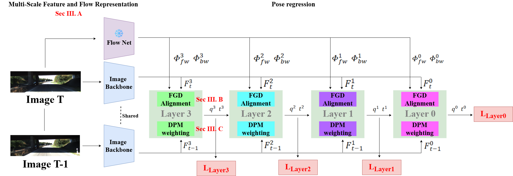

# FGD-VO: An End-to-End Inter-Frame Correspondence Modeling Network for Monocular Visual Odometry
Official repository of the paper: Enhancing Autonomous Vehicle Visual Odometry with Reliable Inter-Frame Correspondence Modeling

## Abstract
*Visual odometry (VO) provides continuous ego-motion estimates for autonomous vehicles (AVs) and is especially critical when Global Navigation Satellite System signals are degraded, such as in urban canyons, tunnels, and overpasses. Recent learning-based monocular VO methods have shown promising accuracy, yet their performance remains constrained by the quality of inter-frame correspondences—the pixel-level associations between consecutive images from which camera motion is inferred. Two aspects of this problem are insufficiently addressed. First, existing methods often lack explicit inter-frame feature alignment and rely on implicit associations, which break down under the spatially non-uniform displacement typical of driving: at highway speed, nearby lane markings shift substantially while distant overpasses barely move, and turning maneuvers at intersections introduce large rotational displacement. Second, correspondences are routinely corrupted by road-specific conditions—independent motion from surrounding vehicles and pedestrians, abrupt lighting transitions at tunnel entrances, and specular reflections from wet road surfaces—yet are not effectively suppressed before pose estimation. To address these issues, we propose FGD-VO, a reliable inter-frame correspondence modeling framework for monocular VO. A Flow-Guided Deformable alignment module uses dense optical flow to provide coarse correspondence priors and refines them with learnable local offsets, enabling adaptive feature alignment under spatially varying displacement. A Dual-Path Reliability Masking strategy combines an explicit flow-consistency cue with a learnable attention mask to suppress unreliable correspondences while emphasizing informative regions. Experiments on the KITTI odometry benchmark show that FGD-VO achieves lower mean translational and rotational errors than representative learning-based monocular VO baselines under the evaluated protocols, demonstrating the benefit of explicit correspondence alignment and reliability-aware masking for driving-scene visual odometry.*



## Contents
1. [Dataset](#1-dataset)
2. [Setup](#2-setup)


## 1. Dataset
Download the [KITTI odometry dataset (color).](https://www.cvlibs.net/datasets/kitti/eval_odometry.php)
The data structure should be as follows:
```
|---data_odometry_color
    |---dataset
        |---sequences
            |---00
                |---image_2
                    |---000000.png
                    |---000001.png
                    |---...
                |---image_3
                    |...
                |---calib.txt
                |---times.txt          
            |---01
            |---...
```

## 2. Setup
- Create a virtual environment using Anaconda and activate it:
```
conda create -n tsformer-vo python==3.8.0
conda activate fgdvo
```

